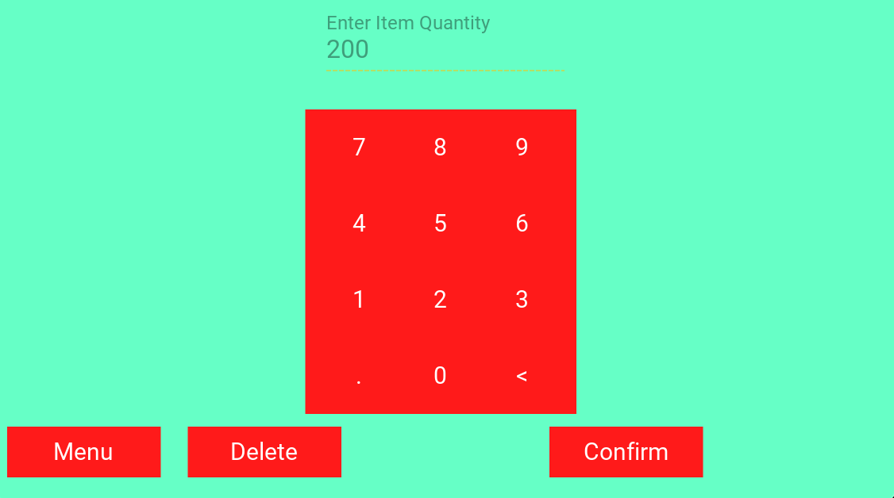
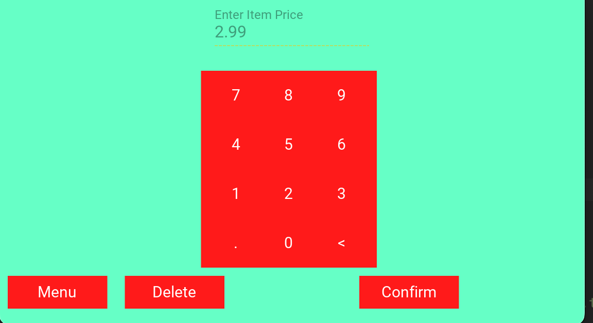
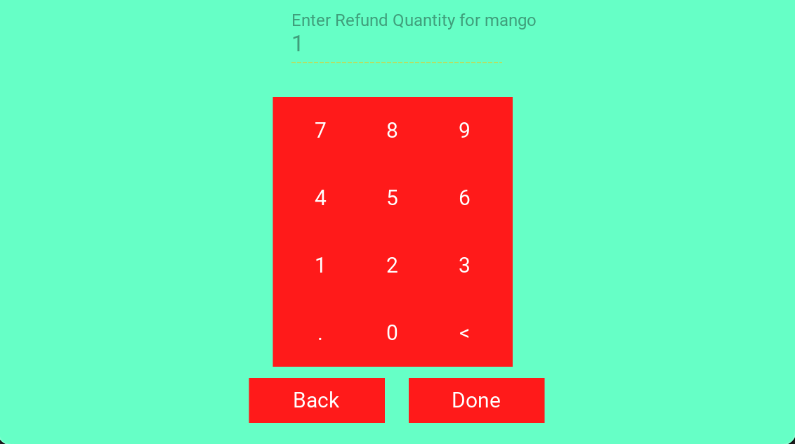
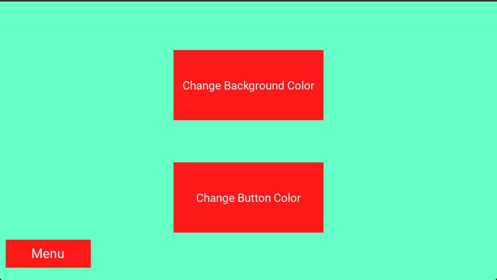

User Guide
================

How to Checkout
------------------

Press on Checkout button in Menu Screen

.. image:: Images/Menuscreen.png
    :align: center
    :height: 300

|
Press on Camera Button
.. image:: Images/CheckoutScreen.png
    :align: center
    :height: 200
|
Press on Confirm Item if item is correct

.. image:: Images/Camera.png
    :align: center
    :height: 200

|
Enter Item Quantity and Press Cart Button

    
|    
Press Back button to return to Checkout Screen or Press Done to finish

    
|    
After order finished Select Yes Button to send receipt as text

.. image:: Images/Text.png
    :align: center
    :height: 200
    
|    
Enter phone number starting with 1 

| Press Done when complete

.. image:: Images/Phone.png
    :align: center
    :height: 200
    
    
How to Add New Item into Inventory
------------------    

|
Press on Inventory Button

.. image:: Images/Menuscreen.png
    :align: center
    :height: 200

|
Press on Add Item Button

|
Type in Item Name and select Confiirm

    
|   
Type in Item Price and select Confiirm

    
|    
Type in Item Quantity and select Confiirm

| New Item now added to Inventory Database

    

How to Modify Price and Quantity of item in Inventory
------------------     

|
Select item from table

|
Type in additional values to Quantity or type - to delete

|    
Select Yes to update price

 
|
Type New Price and select Update Button

       
How to Return Item
------------------   

|
Press on Return Button

.. image:: Images/Menuscreen.png
    :align: center
    :height: 200 
    
|    
Type in Receipt Number

|
Select Item to Refund

 
| 
Type in Refund Amount and select Done

|
Modifed order is Displayed with refund amount

    
    
Change Background Color 
------------------       

|
Press on Customization Button

.. image:: Images/Menuscreen.png
    :align: center
    :height: 200 
    
|    
Press on Change Background Color Button

    
|
Select New Color on Color Wheel and select confirm

|
Exit app and reopen to see changes

Change Button Color 
------------------  

|
Press on Customization Button

.. image:: Images/Menuscreen.png
    :align: center
    :height: 200 

|
Press on Change Button Color Button

|
Select New Color on Color Wheel and select confirm

|
Exit app and reopen to see changes

